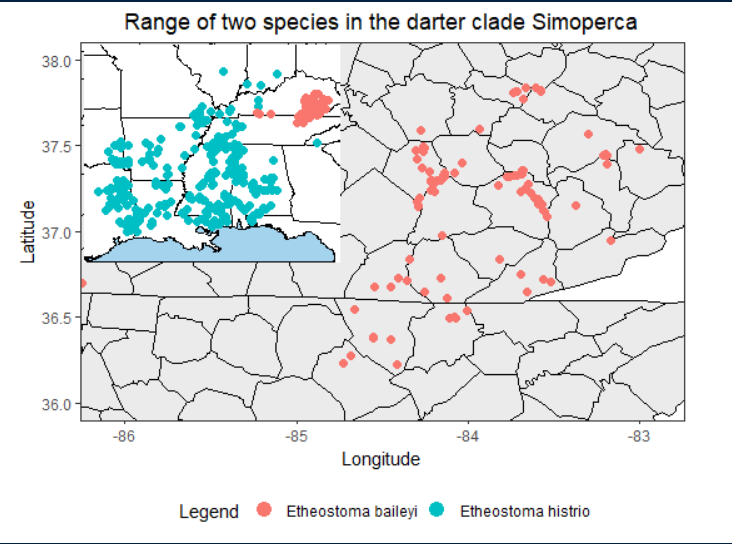

```{r setup, include=FALSE}
knitr::opts_chunk$set(echo = TRUE)
```

```{r Packages, message=FALSE, warning=FALSE, echo=FALSE, results='hide'}
packages<-c("cowplot","dismo","leaflet","maps","mapdata","raster","rasterVis","readxl","rgbif","rgdal","tidyverse","utils","OpenStreetMap")
sapply(packages, library, character.only=T)

```

```{r connect to kml, message=FALSE, warning=FALSE, echo = TRUE, results = 'hide'}
sites <- read.csv("https://raw.githubusercontent.com/RiverAdelle/Mapping.Ass/main/tissue_loc.csv")

leaflet(sites) %>% 
  addTiles(group = "OSM")%>%
  addProviderTiles(providers[["CartoDB.Positron"]], group = "CartoDB") %>%
  addProviderTiles(providers[["Esri.NatGeoWorldMap"]], group = "NatGeo") %>%
  addProviderTiles(providers[["Esri.WorldImagery"]], group = "ESRI") %>%
  addCircleMarkers(popup = sites$Name,
                   label = sites$Name,
                   weight = 1,
                   color = "grey",
                   fillColor = "black",
                   fillOpacity = 0.7) %>% addLayersControl(baseGroups = c("OSM", "CartoDB", "NatGeo", "ESRI"),
    options = layersControlOptions(collapsed = FALSE))
```


## DISMO
```{r dismo}
histrio <- gbif("etheostoma", species = "histrio", ext = c(-96,-84,29,40),
                   geo = TRUE, sp = TRUE, download = TRUE,
                   removeZeros = TRUE)

histrio_df <- cbind.data.frame(histrio@coords[,1],
                                  histrio@coords[,2])

colnames(histrio_df) <- c("x","y")

us <- map_data("state")

ggplot(data = histrio_df, aes(x=x, y=y)) +
  geom_polygon(data = us, aes(x=long, y = lat, group = group),
               fill = "gray92", color="black") +
  geom_point() + xlab("Longitude") + ylab("Latitude") +
  coord_fixed(xlim = c(-97,-84), ylim = c(28,41)) +
  xlab("Longitude") + ylab("Latitude") + ggtitle("Range of the Harlequin Darter, Etheostoma histrio") + 
  theme_bw() + theme(plot.title = element_text(hjust = 0.5)) + 
  theme(panel.grid.major = element_blank(), 
        panel.grid.minor = element_blank(),
        panel.background = element_rect(fill = "lightskyblue2"))
```

## RGBIF
```{r rgbif}
histrio_rgbif <- occ_data(scientificName = "Etheostoma histrio",
                 hasCoordinate = TRUE, limit = 2000,
                 decimalLongitude = "-96, -83", 
                 decimalLatitude = "29, 40")

baileyi_rgbif <-  occ_data(scientificName = "Etheostoma baileyi",
                 hasCoordinate = TRUE, limit = 2000,
                 decimalLongitude = "-96, -83", 
                 decimalLatitude = "29, 40")

histrio_rgbif_df <- cbind.data.frame(histrio_rgbif$data$species,
                                  histrio_rgbif$data$decimalLatitude,
                                  histrio_rgbif$data$decimalLongitude,
                                  histrio_rgbif$data$stateProvince,
                                  histrio_rgbif$data$verbatimLocality)

baileyi_rgbif_df <- cbind.data.frame(baileyi_rgbif$data$species,
                                  baileyi_rgbif$data$decimalLatitude,
                                  baileyi_rgbif$data$decimalLongitude,
                                  baileyi_rgbif$data$stateProvince,
                                  baileyi_rgbif$data$verbatimLocality)

colnames(histrio_rgbif_df) <- c("species","y","x","state","location")
colnames(baileyi_rgbif_df) <- c("species","y","x","state","location")

histrio_rgbif_df <- histrio_rgbif_df[complete.cases(histrio_rgbif_df[1:4]),]
baileyi_rgbif_df <- baileyi_rgbif_df[complete.cases(baileyi_rgbif_df[1:4]),]
```

```{r more rgbif}
ggplot() +
  geom_polygon(data = us, aes(x=long, y = lat, group = group),
               fill = "gray92", color="black") +
  geom_point(data = histrio_rgbif_df, aes(x=x, y=y, color = species), size = 2) +
  geom_point(data = baileyi_rgbif_df, aes(x=x, y=y, color = species), size = 2) +  
  coord_fixed(xlim = c(-96,-83), ylim = c(29,40)) +
  xlab("Longitude") + ylab("Latitude") + ggtitle("Range of two species in the darter clade Simoperca") + 
  guides(color=guide_legend("Legend", override.aes = list(size = 4))) +
  theme_bw() + theme(plot.title = element_text(hjust = 0.5)) + 
  theme(legend.position = "bottom") +
  theme(legend.title.align = 0.5, legend.box.just = "center") +
  theme(panel.grid.major = element_blank(), 
        panel.grid.minor = element_blank(),
        panel.background = element_rect(fill = "lightskyblue2"))

```

```{r whatever, echo = FALSE}
mapmap <- ggplot() +
  geom_polygon(data = us, aes(x=long, y = lat, group = group),
               fill = "white", color="black") +
  geom_point(data = histrio_rgbif_df, aes(x=x, y=y, color = species), size = 2) +
  geom_point(data = baileyi_rgbif_df, aes(x=x, y=y, color = species), size = 2, show.legend = FALSE) +  
  coord_fixed(xlim = c(-96,-83), ylim = c(29,40)) +
  theme_void() +
  theme(panel.grid.major = element_blank(), 
        panel.grid.minor = element_blank(),
        panel.background = element_rect(fill = "lightskyblue2")) +
  theme(legend.position = "none")
mapmap
```

```{r map map map }
library(cowplot)
state <- map_data("state")
county <- map_data("county")
ky <- county %>% 
  filter(region %in% c("tennessee", "kentucky"))
         
         
smallermapmap <-ggplot() +
  geom_polygon(data = state, aes(x=long, y = lat, group = group),
                        fill = "white", color="black") + 
           geom_polygon(data = ky, aes(x=long, y = lat, group = group),
                        fill = "gray92", color="black") +
  geom_point(data = baileyi_rgbif_df, aes(x=x, y=y, color = species), size = 2) +
  geom_point(data = histrio_rgbif_df, aes(x=x, y=y, color = species), size = 2)+  
  coord_fixed(xlim = c(-86.1,-82.9), ylim = c(36,38)) +
  xlab("Longitude") + ylab("Latitude") + ggtitle("Range of two species in the darter clade Simoperca") + 
  guides(color=guide_legend("Legend", override.aes = list(size = 4))) +
  theme_bw() + theme(plot.title = element_text(hjust = 0.5)) + 
  theme(legend.position = "bottom") +
  theme(legend.title.align = 0.5, legend.box.just = "center") +
  theme(panel.grid.major = element_blank(), 
        panel.grid.minor = element_blank(),
        panel.background = element_rect(fill = "lightskyblue2"))
smallermapmap


```


```{r please}
#ggdraw() +
#draw_plot(smallermapmap) + 
#draw_plot(mapmap, x = 0.141, y = 0.52, width = 0.4, height = 0.4)

```




```{r eaffff}
colors <- colorFactor(c("#F8766D","#00BA38","#619CFF"), histrio_rgbif_df$state)

leaflet(histrio_rgbif_df) %>% 
  addTiles() %>% 
  addCircleMarkers(histrio_rgbif_df$x,
                   histrio_rgbif_df$y,
                   popup = histrio_rgbif_df$species,
                   weight = 2,
                   color = colors(histrio_rgbif_df$state),
                   fillOpacity = 0.7) %>%
  addMiniMap(position = 'topright',
             width = 100, 
             height = 100,
             toggleDisplay = FALSE) %>%
  addScaleBar(position = "bottomright")
```

#RGS
```{r connection}
rgs_rgbif <- occ_data(scientificName = "Opheodrys aestivus",
                 hasCoordinate = TRUE, limit = 2000,
                 decimalLongitude = "-98, -82", 
                 decimalLatitude = "27, 42")

rgs_rgbif_df <- cbind.data.frame(rgs_rgbif$data$species,
                                  rgs_rgbif$data$decimalLatitude,
                                  rgs_rgbif$data$decimalLongitude,
                                  rgs_rgbif$data$stateProvince,
                                  rgs_rgbif$data$verbatimLocality)
colnames(rgs_rgbif_df) <- c("species","y","x","state","location")

rgs_rgbif_df <- rgs_rgbif_df[complete.cases(rgs_rgbif_df[1:4]),]

ggplot() +
  geom_polygon(data = us, aes(x=long, y = lat, group = group),
               fill = "gray92", color="black")  +
  geom_point(data = rgs_rgbif_df, aes(x=x, y=y), size = 2)+  
  coord_fixed(xlim = c(-98,-82), ylim = c(27,42)) +
  xlab("Longitude") + ylab("Latitude") + ggtitle("Range of the Rough Greensnake, Opheodrys aestivus") + 
  guides(color=guide_legend("Legend", override.aes = list(size = 4))) +
  theme_bw() + theme(plot.title = element_text(hjust = 0.5)) + theme(panel.grid.major = element_blank(), 
        panel.grid.minor = element_blank(),
        panel.background = element_rect(fill = "lightskyblue2"))


```

## Species Distribution Climate Map

```{r species distribution, echo=TRUE, message=FALSE, warning=FALSE}
bioclim <- getData(name = "worldclim", res = 2.5, var = "bio", path = "./")

names(bioclim) <- c("Ann Mean Temp","Mean Diurnal Range","Isothermality","Temperature Seasonality",
                    "Max Temp Warmest Mo","Min Temp Coldest Mo","Ann Temp Range","Mean Temp Wettest Qtr",
                    "Mean Temp Driest Qtr","Mean Temp Warmest Qtr","Mean Temp Coldest Qtr","Annual Precip",
                    "Precip Wettest Mo","Precip Driest Mo","Precip Seasonality","Precip Wettest Qtr",
                    "Precip Driest Qtr","Precip Warmest Qtr","Precip Coldest Qtr")

bio_extent <- extent(x = c(
  min(rgs_rgbif_df$x),
  max(rgs_rgbif_df$x),
  min(rgs_rgbif_df$y),
  max(rgs_rgbif_df$y)))

bioclim_extent <- crop(x = bioclim, y = bio_extent)
bioclim_model <- bioclim(x = bioclim_extent, p = cbind(rgs_rgbif_df$x,rgs_rgbif_df$y))
presence_model <- dismo::predict(object = bioclim_model, 
                                 x = bioclim_extent, 
                                 ext = bio_extent)
```


```{r species distribution maps, echo=TRUE, message=FALSE, warning=FALSE, fig.height=6, fig.width=10}
gplot(presence_model) + 
  geom_polygon(data = us, aes(x= long, y = lat, group = group),
               fill = "gray", color="black") +
  geom_raster(aes(fill=value)) +
  geom_polygon(data = us, aes(x= long, y = lat, group = group),
               fill = NA, color="black") +
  geom_point(data = rgs_rgbif_df, aes(x = x, y = y), size = 2, color = "black", alpha = 0.5) +
  scale_fill_gradientn(colours=c("brown","yellow","darkgreen"), "Probability") +
  coord_fixed(xlim = c(-98,-82), ylim = c(27,42)) +
  xlab("Longitude") + ylab("Latitude") + ggtitle("Probability of PILO Occurrence") + 
  theme_bw() + theme(plot.title = element_text(hjust = 0.5)) + theme(legend.position = "right") +
  theme(panel.grid.major = element_blank(), 
        panel.grid.minor = element_blank(),
        panel.background = element_rect(fill = "lightblue"))
```

